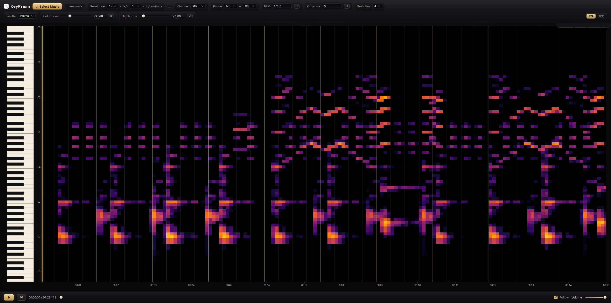

<div align="center">


# KeyPrism

**English** | [简体中文](README_CN.md)

</div>

**KeyPrism** — piano-key spectrogram player.
A spectral prism that resolves audio onto a piano semitone grid: time on the
horizontal axis, 88 keys on the vertical axis (subdividable down to 1/10
semitone), color as energy intensity, with synchronized playback and a full
suite of interactive analysis tools.

```
audio → STFT → semitone aggregation → interactive heatmap + player
              ├→ source separation (HPSS / RPCA) → stem player
              └→ Demucs separation (4/6-stem, optional [dl]) → lane workspace
                                            └→ polyphonic notes (Basic Pitch)
```

<div align="center">



</div>

## Feature Overview

### Spectral Analysis
- **Piano-pitch heatmap**: time on the horizontal axis (adaptive scale, one
  tick per second for windows within 16s), 88 semitones on the vertical axis
- **Stereo, three channels**: mix / left / right spectra, unified peak
  normalization (dB comparable across channels)
- **Switchable resolution**: time-column density 15/30/60 columns per second
  × semitone subdivision 1/5/10 subbands, recomputed live by the backend
  (serve mode required) with a progress dialog and staged progress bar
- **Subband widening**: in high-subdivision modes, energy is widened along the
  frequency axis with a triangular kernel to avoid visual fragmentation
- **BPM detection**: spectral-flux autocorrelation estimates BPM and first-beat
  offset, with a measure grid overlay (BPM / offset / time signature can be
  corrected manually)
- **Monophonic transcription (bass / lead)**: preset-driven note detection
  (harmonic salience with subharmonic suppression, band-limited onsets,
  Viterbi single-pitch decoding) rendered as colored note rectangles over
  the heatmap with an Off/Bass/Lead/Both selector; results cached per track
  and served on demand (`/api/notes`, serve mode required)
- **MIDI export**: one click downloads the transcribed tracks as a Standard
  MIDI File (type 0 single track / type 1 for both, detected BPM tempo map,
  velocity scaled by note confidence)
- **Classic source separation (stems)**: training-free HPSS (median-filter
  harmonic/percussive masks), RPCA (chunked ADMM low-rank/sparse) and a
  combined fusion are computed on demand against the cached complex STFT
  and rendered to per-stem WAV files (original phase preserved), cached
  under the analysis entry and served on demand (`/api/stems`, serve mode
  required)
- **Stem player & DAW mixer**: a multi-track panel (per-stem faders with a
  live dB readout, Mute, Solo plus a Mix row for the original track) driven
  by the same transport — all stems start on one absolute AudioContext
  timestamp together with the mix, so playback is sample-accurately
  synchronized. Mixer semantics are DAW-grade: solo is destructive
  (materialized as real mute states, so M and S can never both light up),
  each stem gets a make-up gain default (so a lone stem auditions at
  mix-comparable loudness), and a brickwall limiter (−1 dB threshold,
  20:1, 1 ms attack) guards the master bus against summed overshoots;
  mute/solo switch via ramped gain nodes without clicks or pops; stems are
  downloadable as WAVs for external DAWs
- **DL separation — Demucs (optional `[dl]` extra)**: with the optional
  deep-learning dependencies installed (`uv sync --extra dl`), htdemucs
  4-stem and the MIT-licensed 6-stem export (drums / bass / other /
  vocals / guitar / piano — auto-downloaded on first use with recorded
  provenance) run locally via ONNX Runtime: the track is processed in
  fixed model-segment chunks with a 50% overlap blended by a
  strictly-positive Hann window normalized by the accumulated window sum
  (seam-free cross-fades, exact edge reconstruction, memory bounded by
  one chunk — the full track is never handed to the model). Stems are
  cached like classic stems and downloadable as WAVs. Without the extra
  every DL endpoint answers a clean `501` and the frontend hides the
  options — the app keeps working on the Phase 2 pipeline
- **Inference quality tiers & device selection (optional)**: quality
  fast / balanced / best trades speed for accuracy via demucs shift
  averaging (1 / 2 / 3 inference passes around the untouched ONNX graph;
  tier-aware stem cache); the Device selector (Auto / GPU / CPU) routes
  the ONNX Runtime execution providers, with the GPU option disabled
  when the installed build has none. GPU builds (`[dl-cuda]` on Linux,
  `[dl-directml]` on Windows) auto-detect their provider chain, ship the
  CUDA 13 runtime as pip wheels with a gated preload (a complete system
  CUDA install wins; the wheels only fill gaps), and fall back silently
  to CPU when a GPU EP is missing or fails — a GPU-less setup degrades,
  never crashes. `/api/ping` reports the active provider chain (the
  GPU/CPU badge in the panel)
- **Multi-lane workspace (optional)**: a stacked-lane panel (Mix +
  vocals/drums/bass/other or the six Demucs stems) with per-lane
  waveform, volume, Mute/Solo, all lanes sample-locked to the shared
  transport clock (per-lane playheads ride the master cursor's frame
  loop; high-res waveforms are computed in a Web Worker for zoomed-in
  views). Polyphonic piano/guitar/other note overlays (Basic Pitch with
  same-pitch fragment merging, 50 ms gap threshold) render on a
  dedicated HTML canvas per lane — never SVG shapes — spatially indexed
  (binary search over sorted starts) and re-synced to the main
  spectrogram's zoom/pan on every relayout. Long runs are background
  tasks with live progress, model-download phase and Stop/Restart
  controls (cooperative cancel at chunk boundaries; Restart re-submits
  with the cache bypassed)
- **Layer compositor (optional)**: drag a lane's ⧉ handle onto the master
  spectrogram to overlay that stem's semitone spectrogram exactly on the
  master plot (time and pitch axes shared with the master heatmap,
  brightness normalized against the master's mix peak so an overlay reads
  its true share of the mix). Layers blend via CSS mix-blend-mode —
  叠加 (screen: dark pixels are no-ops) or 覆盖 (normal: opaque) — with
  per-layer opacity, gain (±24 dB) and highlight-γ reshaping, plus
  visibility / drag-to-reorder / remove in a top-right manager; overlays
  repaint only on view changes, never during playback
- **Online track picking**: the "Select music" button in the top bar picks a
  local audio file, uploads it to the backend for analysis and switches the
  whole page (serve mode required)
- **Audio formats**: mp3/wav/ogg/flac read directly; other common containers
  such as m4a/aac/wma/opus/aiff are decoded via PyAV (ffmpeg) as a fallback
  when sndfile cannot handle them, and automatically transcoded to a
  fully browser-compatible PCM WAV for playback; files without an audio track
  produce a clear error

### Interaction & Playback
- **Web Audio playback engine**: the whole PCM track is pre-decoded, seeking
  is instant and stutter-free, with a sample-accurate clock
- **Playback cursor**: rendered as an HTML overlay with `transform` for smooth
  full-frame motion; aligned with "what the ear hears" (output latency
  compensated) and waits for buffering before starting
- **Click anywhere on the spectrogram** to seek playback (no autoplay)
- **Follow playback**: toggleable auto-panning viewport
- **Navigation bar**: full-track energy envelope as backdrop, draggable window
  (constant width) / handles to resize / click to jump
- **Color controls**: 6 palettes (lower anchor pinned to pure black, silence
  sinks into the background) + color floor slider + highlight γ power
  transform (nonlinear mapping emphasizing current leading pitches), all with
  click-to-type values and one-click reset

### Misc
- Pitch range clipping at both ends (keyboard and scale adapt automatically)
- Volume capped at −10 dB (noise protection), volume persistence
- Dark console-style UI

## Repository Layout

```
keyprism/
├── src/                   # backend source (src layout, package name keyprism)
│   └── keyprism/          # backend Python package (all backend code lives here)
│       ├── __main__.py    # python -m keyprism entry point
│       ├── cli.py         # CLI argument parsing and dispatch
│       ├── dsp.py         # pure algorithms: STFT / semitone aggregation / downsampling / BPM
│       ├── transform.py   # complex STFT/ISTFT + dB magnitude + peak refine (zero IO)
│       ├── audio_io.py    # decode chain: sndfile→PyAV fallback / browser transcoding / path constants
│       ├── analyze.py     # staged analysis orchestrator + complex-STFT disk cache
│       ├── payload.py     # frontend contract: single source of truth for data.json fields
│       ├── tracks.py      # monophonic preset registry (bass / lead)
│       ├── salience.py    # loudness weighting + harmonic salience (zero IO)
│       ├── onset.py       # band-limited adaptive onset detection (zero IO)
│       ├── decode.py      # Viterbi single-pitch decoder (zero IO)
│       ├── midi_io.py     # note events → Standard MIDI File (zero IO)
│       ├── transcribe.py  # notes orchestration + per-track notes cache
│       ├── hpss.py        # median-filter HPSS masks (zero IO)
│       ├── rpca.py        # chunked inexact-ALM RPCA (zero IO)
│       ├── stems.py       # stem synthesis + per-entry stem cache
│       ├── dlsep.py       # Demucs ONNX chunked separation + DL stem cache (optional [dl])
│       ├── poly_transcribe.py  # Basic Pitch polyphonic notes + fragment merging (optional [dl])
│       └── server.py      # HTTP service: /api/ping /api/spec /api/notes /api/stems /api/task /api/upload
├── pyproject.toml         # uv project definition (deps locked in uv.lock, TUNA index by default)
├── scripts/               # launch & release scripts (config & ports below)
│   ├── start.sh           # one-command start, Linux / macOS
│   ├── start.cmd          # one-command start, Windows
│   └── release.sh         # version cut-off: bump + changelog + release PR
├── tests/                 # pytest regression suite: one layer each (see below)
├── assets/                # static assets such as the demo audio
│   └── demo.m4a
├── docs/                  # developer docs (HTTP API reference etc.)
│   └── api.md
└── frontend/              # Vite frontend (vanilla JS + plotly.js)
    ├── index.html
    ├── vite.config.js
    ├── public/            # backend output: data.json + audio.*
    └── src/
        ├── main.js        # entry: data loading and control wiring
        ├── spectrogram.js # heatmap + keyboard + measure grid + layout
        ├── ticks.js       # adaptive ticks + time-range clamping
        ├── i18n.js        # EN/中文 UI translations + language persistence
        ├── player.js      # Web Audio playback engine + transport events
        ├── notes.js       # note overlay (Phase 1 transcription)
        ├── stems.js       # stem player: Web Audio multi-track sync (Phase 2)
        ├── lanes.js       # multi-lane DL workspace: canvas lanes + poly notes (Phase 3)
        ├── mixer.js       # DAW mixer state: destructive solo, make-up gain, master bus
        ├── controls.js    # shared panel-row factory (volume / M / S / Notes)
        ├── geometry.js    # shared plot geometry (master + lane pixel contract)
        ├── layers.js      # layer compositor: stem-spectrum overlays on the master
        ├── stemspec.js    # stem spectrogram fetch cache + intensity shaping
        ├── wavelod.js     # LOD waveform cache (Web Worker client)
        ├── wave-worker.js # per-pixel-column min/max worker
        ├── specfeed.js    # wheel-gesture pan/zoom slide for the heatmap trace
        ├── trackIcons.js  # inline SVG glyphs for mixer row labels
        ├── toast.js       # dismissible toast messages
        └── style.css
```

## Testing

`tests/` implements no product features; it is an automated regression suite.
After changing code, run `uv run pytest -q`: 172 cases covering DSP algorithms
(including a deterministic 120 BPM click-track case), the decode-chain
fallback (real m4a encoding), the payload contract (field-by-field assertions
the frontend depends on), transcription (synthetic note recovery), source
separation (HPSS/RPCA synthesis, ADMM convergence, chunked-vs-full
equivalence, streaming ISTFT exactness), the DL workspace (graceful
degradation to 501, Demucs chunking/reconstruction math, note fragment
merging, background-task plumbing, frontend canvas-sync source contract),
and all HTTP routes (upload switching / notes / stems / error codes / CORS
preflight). The DL cases stub the optional models, so the same suite runs
green with AND without the `[dl]` extra installed. It is the safety
net for refactoring and new features — keep it.

CI (`.github/workflows/ci.yml`) runs the same flow automatically on every
push / PR: backend `uv sync + pytest` + launch-script syntax check, frontend
`npm ci + build`, about 2 minutes in total. Stale tests are blocked outright —
either fix the code or consciously update the tests.

For architecture intent, maintenance rules and known pitfalls aimed at
developers, see `AGENTS.md` (also read automatically by AI coding agents).

### Releasing (developers)

Merging devel into master **is** a release. The cut is scripted:
`scripts/release.sh --bump minor` bumps the version (`pyproject.toml` +
`uv.lock`), finalizes the CHANGELOG and opens the release PR. After the merge
a workflow takes over automatically: it tags `v<version>`, publishes the
GitHub Release from the CHANGELOG section and syncs master back into devel
(keeping "devel behind master" at zero). Full rules and hard-learned pitfalls
(solo `--admin` merge, exact-string matching of required CI check names) live
in `AGENTS.md`.

## Workspace (`~/.keyprism`)

Logs, caches and upload staging are consolidated into a user workspace so they
never pollute the project directory or system temp directories; it can be
relocated wholesale via the `KEYPRISM_HOME` environment variable (`~` prefix
supported):

```
~/.keyprism/
├── logs/               # backend.log / vite.log (redirected by launch scripts)
├── cache/matplotlib/   # matplotlib font and config cache
├── cache/analysis/     # complex-STFT analysis cache (stft.npy + meta.json,
│                       #   plus per-entry notes/ and stems/ results)
├── models/demucs/      # optional Demucs ONNX weights (auto-downloaded by the
│                       #   [dl] extra; KEYPRISM_DEMUCS4_FILE / KEYPRISM_DEMUCS6_FILE
│                       #   point at explicit files, *_REPO at alternate HF repos)
├── uploads/            # staging for audio uploaded via "Select music" (only the latest few are kept)
└── config.env          # optional persistent config: KEY=VALUE, lines starting with # are comments
```

Config precedence: **environment variables > `config.env` > built-in
defaults** (`config.env` only recognizes keys prefixed with `KEYPRISM_`, and
never overrides already-exported environment variables):

| Variable | Description | Default |
|------|------|------|
| `KEYPRISM_HOME` | workspace root | `~/.keyprism` |
| `KEYPRISM_LOG_DIR` | log directory | `$KEYPRISM_HOME/logs` |
| `KEYPRISM_CACHE_MAX_ENTRIES` | analysis-cache LRU capacity (per track+params) | `8` |
| `KEYPRISM_API_HOST` | backend listen address (use `0.0.0.0` for LAN access) | `127.0.0.1` |
| `KEYPRISM_API_PORT` | backend API port | `9630` |
| `KEYPRISM_FRONTEND_PORT` | frontend page port | `5270` |

## Requirements

- **Python 3.10+**, environment managed with [uv](https://docs.astral.sh/uv/)
  (creates the venv and locks dependencies automatically)
- **Node.js 20.19+** (for the Vite 7 frontend; `npm run dev` will not start on
  lower versions)
- Optional DL separation/transcription (Phase 3): `uv sync --extra dl`
  installs `onnxruntime` + `basic-pitch` + `huggingface-hub`; Demucs weights
  (4-stem, and the 6-stem export) are downloaded automatically on first use
  into `~/.keyprism/models/demucs/` (or drop any compatible htdemucs ONNX
  export there; on networks that cannot reach huggingface.co set
  `HF_ENDPOINT=https://hf-mirror.com`). Everything works without it — the
  DL features simply answer 501 and stay hidden in the UI
- Optional GPU acceleration: `uv sync --extra dl --extra dl-cuda` (Linux,
  NVIDIA — installs `onnxruntime-gpu` plus the CUDA 13 runtime as pip
  wheels, preloaded automatically) or `uv sync --extra dl --extra
  dl-directml` (Windows, any GPU vendor). Install at most one of the two
  onnxruntime builds; a missing/broken GPU extra is a silent CPU fallback,
  never an error, and `KEYPRISM_ORT_PROVIDERS` can pin the provider chain

## Quick Start

```bash
# 1) One-command launch (first run does uv sync + npm install automatically;
#    without arguments it loads assets/demo.m4a by default)
#    Windows:
scripts\start.cmd
#    Linux / macOS:
./scripts/start.sh [audio file]

# 2) Open http://localhost:5270 in a browser
#    In the VS Code integrated terminal, both ports appear in the Ports panel
```

The script starts both services (Ctrl+C stops everything; on Windows close
the minimized windows):
- Backend API `http://localhost:9630` (analysis service, supports hot
  resolution switching / audio upload)
- Frontend page `http://localhost:5270`

Ports and the workspace can be changed via environment variables or
`~/.keyprism/config.env` (see the section above).

### Manual Step-by-Step

```bash
# Backend: uv creates the environment and installs deps automatically
# (assets/demo.m4a is the default when no audio is given)
uv run python -m keyprism --serve 9630

# Frontend
cd frontend
npm install
npm run dev -- --port 5270 --strictPort
```

Static mode (no long-running service; resolution fixed at launch options):

```bash
uv run python -m keyprism song.mp3 --rate 15 --sub 1
```

## Backend Options

```
uv run python -m keyprism [audio] [--serve PORT] [--rate R] [--sub S]
                              [--start sec] [--end sec]
                              [--window 8192] [--db-range 70]
```

| Option | Description | Default |
|------|------|------|
| `audio` | input audio file; `assets/demo.m4a` is loaded when omitted | `assets/demo.m4a` |
| `--serve PORT` | long-running API mode; the frontend can hot-switch resolution / upload audio | off |
| `--host` | serve-mode listen address (use `0.0.0.0` for LAN access) | `127.0.0.1` |
| `--rate` | time-column density (columns/second), one of 15/30/60 | 15 |
| `--sub` | subbands per semitone, one of 1/5/10 | 1 |
| `--start` / `--end` | analyze only a segment of the audio | whole track |
| `--window` | STFT window size (samples, power of two) | 8192 |
| `--db-range` | dynamic range in dB | 70 |

## HTTP API (serve mode)

| Endpoint | Description |
|------|------|
| `GET /api/ping` | health check + DL capability flags (`capabilities.dl` / `capabilities.poly` / `dl_methods` / `ort_providers` / `ort_providers_available`) |
| `GET /api/spec?rate=15&sub=5` | recompute the spectrum at the given resolution (three channels + envelopes), cached |
| `GET /api/notes?track=bass\|lead\|both` | monophonic transcription notes, cached per track |
| `GET /api/notes?track=piano\|guitar\|other&method=poly[&source=demucs_6]` | polyphonic notes of a DL stem (Basic Pitch, merged fragments; 501 without the `[dl]` extra) |
| `GET /api/midi?track=bass\|lead\|both` | the same notes as a Standard MIDI File download |
| `GET /api/stems?method=hpss\|rpca\|combined` | separated stems of the current track (`&progress=1` polls a running computation) |
| `GET /api/stems?method=demucs_4\|demucs_6` | serve computed DL stems from the entry cache (404 until computed) |
| `POST /api/stems?method=demucs_4\|demucs_6[&quality=fast\|balanced\|best][&device=auto\|gpu\|cpu][&force=1]` | start DL separation as a background task; returns `{"task_id", "status_url"}` (501 without the `[dl]` extra; cached results short-circuit unless `force=1`; quality/device are cache-aware) |
| `GET /api/task/{task_id}` | background-task poll: `{"status": "running"\|"downloading"\|"done"\|"error"\|"cancelled", "progress": 0..1, "stems": [...]}` |
| `POST /api/task/{task_id}/cancel` | cooperative stop: cancels at the next chunk/segment boundary; partial downloads are discarded |
| `GET /api/stem?method=..&name=..` | one stem as a WAV attachment download (classic and DL methods) |
| `GET /api/stem_spec?method=..&stem=..` | the stem's semitone spectrogram (88 rows, dB against the master mix peak) for lane mini-spectrograms and overlay layers |
| `POST /api/upload?name=song.mp3` | upload a local audio file (request body is raw file bytes); the backend analyzes it, switches the current track and refreshes `data.json`; returns the full payload |

For the full reference (error codes / response structure / preflight) see
`docs/api.md`.
Upload example: `curl -X POST --data-binary @song.m4a 'http://localhost:9630/api/upload?name=song.m4a'`;
size cap 512 MB; the decode chain is libsndfile → PyAV (ffmpeg) fallback,
covering mainstream audio formats.

## Frontend Controls Cheat Sheet

| Action | Effect |
|------|------|
| ♪ Select music | opens a file picker; a local audio file is uploaded, analyzed by the backend and the page refreshes automatically (serve mode required) |
| Scroll wheel | zoom the time axis (pitch axis locked) |
| Drag the spectrogram | pan (clamped at both ends; cannot drag past the track) |
| Double click | restore the full-track view |
| Click the spectrogram | seek playback (no autoplay) |
| Stems → On | computes/serves the separated stems and opens the stem panel below the plot (serve mode required); the mix is muted automatically and hands back on Off |
| Stem panel | per-stem fader with live dB readout (defaults to make-up gain), M (mute), S (solo); method switch (combined / HPSS / RPCA); download via `/api/stem` links; the master bus runs through a brickwall limiter |
| Lanes → On | opens the DL workspace panel (serve mode + `[dl]` extra required); the mix is muted automatically and hands back on Off; nothing auto-analyzes |
| Lane control strip | method (classic HPSS/RPCA/combined or Demucs 4/6-stem), quality (fast / balanced / best), device (Auto / GPU / CPU), GPU/CPU badge, and ▶ Run / ⏹ Stop / ↻ Restart: Run submits the separation task (live progress incl. model-download phase), Stop cooperatively cancels it, Restart cancels + re-runs bypassing the cache |
| Lane panel | per-lane waveform (LOD hi-res when zoomed in) or mini-spectrogram ([Wave\|Spec] toggle), volume slider, M (mute), S (solo); PX toggles the polyphonic note overlay (piano/guitar/other); lanes zoom/pan in lockstep with the main spectrogram |
| Drag a lane's ⧉ handle onto the master | overlays that stem's spectrogram as a compositor layer (叠加 screen / 覆盖 normal blend, per-layer opacity, gain ±24 dB, highlight γ; manage/reorder/remove top-right) |
| Bottom navigation bar | drag the window to pan / drag handles to resize / click empty space to jump |
| Top bar | resolution, channel, pitch range, BPM, offset, time signature, palette, color floor, highlight γ |
| Click a numeric label | type a value directly (Enter commits / Esc cancels), ↺ restores the default |

## Technical Notes

- **Time mapping**: after downsampling each column maps to the center of its
  time block (`hop × block`); the frontend calibrates against the full-track
  duration evenly, eliminating drift from inconsistent columns/second
- **Playback sync**: `AudioContext` scheduling + `outputLatency` compensation
  + buffer wait at start; the cursor is a DOM overlay and never triggers
  plotly reflows
- **Performance**: heatmap restyle throttling (leading+trailing 120ms);
  high-resolution decoding is chunked and asynchronous, keeping only the
  current channel's float matrix resident
- **Color floor anchor pinned to pure black**: only the first anchor color
  changes; transitions between anchors remain linear, orthogonal to the γ
  transform
- **Online track-picking pipeline**: the frontend XHR-uploads raw file bytes
  (with an upload progress bar); the backend streams to a staging directory →
  decodes and analyzes → atomically switches the server-side track state and
  clears the resolution cache; the audio URL carries a cache-busting
  parameter so a stale browser-cached file is never read after switching
  tracks
- **Analysis cache**: the full-resolution mix-channel complex STFT is
  cached under `~/.keyprism/cache/analysis/` as a memmap-able complex64
  artifact (content-hash keys over the decoded audio + analysis params;
  LRU eviction capped by `KEYPRISM_CACHE_MAX_ENTRIES`, default 8).
  Re-analyzing the same track with the same settings skips the STFT stage
  entirely; delete the directory to reclaim space or force a recompute
- **Stem separation**: HPSS/RPCA masks are computed in memmap row chunks
  (never a full-track complex or mask matrix in RAM) and multiplied into
  the complex STFT so the original phase is kept; the streaming ISTFT
  emits only sample ranges whose overlap-add contributors are complete,
  making the output bit-consistent with a full-matrix reconstruction.
  Stems cache next to the STFT entry (`stems/<version>/<method>/`), so
  the first request for a method pays the compute (a few seconds for the
  demo track) and later requests serve files instantly
- **DL separation**: the ONNX graph embeds its own STFT/iSTFT sized for
  one fixed segment (~7.8 s @ 44.1 kHz), so chunks follow the model
  (50% overlap, COLA-exact Hann, zero-padded tail) and the ONNX session
  is a singleton per model + provider chain. Quality tiers wrap the same
  graph with circular shift → infer → shift back passes and average
  them (fast/balanced/best = 1/2/3 passes; `shifts=0` is byte-equivalent
  to the single pass). GPU providers are probed (CUDA → DirectML →
  CoreML, CPU always last), the CUDA 13 pip wheels are preloaded only
  when they actually fill a gap, and a GPU EP that fails at first
  inference evicts the session and retries pure CPU — the stems come
  out identical either way
- **Stem player sync**: every stem and the mix are scheduled with
  `source.start(when, offset)` on ONE shared AudioContext at ONE absolute
  timestamp (`ctx.currentTime + 0.06`), so multi-track playback is
  sample-accurate with no drift; mute/solo/volume only ramp GainNodes
  (`setTargetAtTime`), never rescheduling, which keeps switching
  click-free

## License

MIT
